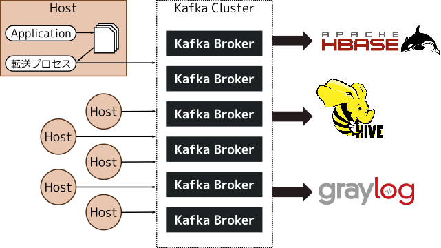

---
# サイボウズのサービスを 支えるログ基盤
: { "class": "title" }

## ゼロからの刷新とこれから

Cybozu Meetup #6, 2017-07-25

@ueokande

Cybozu Inc.

---
# whois

- 上岡 真也
- 2016年サイボウズ入社
- アプリケーション基盤チーム
- GitHub/Twitter: @ueokande

---
# 目次

- cybozu.comのこれまでのログ基盤
- ログ基盤のゼロからの刷新
- 新しいログ基盤のこれから

---
: { "class": "section" }

# cybozu.comの これまでのログ基盤

---
: { "class": "cybozucom" }

# cybozu.com

---
# cybozu.comとは

- 2011年にスタートした、企業向けクラウドサービス
- 契約者数 19,000社以上
- ユーザ数70万人以上
- リクエスト数1.7億/day

---
# cybozu.comを支えるインフラ

- 自社製データセンター
- ホスト数（実機 + VM）: 1000程度
- ログ量
  20億 行/day,
  800 GB/day くらい  
  （毎秒平均 23,000行 くらい）

---
# なぜログが重要か

- ログはWebサービスの健康状態を示す
    - 障害対応の手がかり
- サービスの改善に役立てる
    - 性能検証
    - ユーザの行動をビジネスに利用する

---
# これまでのcybozu.comのログ基盤

1. ログを毎分ローテート
2. ローテートされたログをtarに固める
3. SSHでtarをストレージサーバーに転送
4. 転送が完了したログをホストから削除

---
# そろそろ限界...

## ログ量が帯域ぎりぎり
- スケールしたいけどできない

## 転送システムがSPOF
- うっかりログ転送が止まるとホストがDisk Fullに

## ログを活用できていない
- 可視化・解析できていない、新しい仕組みも導入しにくい

---
: { "class": "damm" }

# ちくちょう。 刷新だ！

sleeping worker by reynermedia - flickr | <u>https://www.flickr.com/photos/89228431@N06/11285432175</u>

---
: { "class": "section" }

# ログ基盤のゼロからの刷新

---
# 新ログ基盤の要件

## at least once

- ログを取りこぼすことなく集める

## 信頼性

- どこかで障害が発生しても、全体の転送が止まらない

## スケーラビリティ

- ログを活用できるサービスを容易に導入できる

---
# 新ログ基盤アーキテクチャ

- 各ホストはKafkaクラスタに対してログを吐き出す
- Kafkaからぞれぞれのサービスがログを利用

---
# Apache Kafkaとは

- pub/sub型の分散メッセージングシステム
- LinkedInが開発してOSS化した
- Twitter、Netflix、LINEなどの採用実績

---
# Apache Kafkaを使う理由

## 分散メッセージングサービス

- Brokerを追加することで容易にスケール
- Broker間でレプリケーション

## pub/sub型

- 入力と出力が独自のタイミングでを読み書きする
- pub/sub間のスループットやタイミングを考えなくてもよい

---
# 各ホストからKafkaへの転送

- ログファイルの更新を監視してKafkaに送る
- ローテートされて転送が完了したログはディスクから削除

---
# Kafka clusterから各サービス

## HBase

- ログをHadoop上に長期保存する

## Hive

- ユーザの動向をクエリで検索・解析する

## Graylog

- ログの検索、監視

---
# At least once

- システム全体で、ログを取りこぼすことなく配送
- どこかのホストが**突然の死**を遂げても、ログのデータロスが発生しない
- ログの重複は許す（≠ exactly once）

---
# At least once | Kafkaへのログ転送

- 初めはFluentdでKafkaへの転送で構築していたが、at least onceを満たせないことが判明

- 自前でat least onceを満たす転送エージェントを実装
    - 状態はatomicに更新
    - バックプレッシャー

---
# At least once | Kafkaからの転送

- HiveやHBaseへの経路は冗長構成
- HDFS上のファイル操作もatomicに更新する必要がある

---
# At least once | 長いログの対応

- Kafkaのレコード長には上限がある
- MySQLのスローログでは1行が10MBを超えるケースもある
- Kafkaのレコードに、断片化されたログかのフラグを付与
- Kafkaからログを取り出す時、再び結合

---
# 信頼性とスケーラビリティ

## 信頼性

- Kafka/Hadoopのノードが死んでも全体の転送は止まらない
- ラックごとの電源が落ちても大丈夫なよう、同クラスタの各ノードはラックを分離

## スケーラビリティ

- 用途に応じて、様々なKafka Consumerを追加できた
- ログ量が増えたら、Kafkaノードを増やしてスケール

---
# 新ログ基盤の要件

## at least once

- → 電源断してもデータロスが起こらないように設計

## 信頼性

- → 冗長性をもたせたクラスタ構成とラック設計

## スケーラビリティ

- → Kafkaで必要なサービスも追加できた

---
# 苦労話 | 転送遅延

- ある日、Kafkaからの転送が大きく遅延した
- 幸い本番環境と同じ環境を開発環境に構成してたために気付けた
- Kafkaのパラメータチューニングして解決

---
# 苦労話 | journaldに悩まされる

- ホストのすべてのログをjournaldに集める計画もあった
- 社内でjournaldを導入してみたらいろいろ問題が
    - 長いログの行が勝手に分割される
    - Disk Full時にjournaldが死亡する
- 結局ファイル最強だった

---
: { "class": "section" }

# 新しいログ基盤のこれから

---
# これからのログ基盤

## 可視化・解析
- Redashでいい感じにHiveのクエリを可視化
- ページビューとユーザデータを組合せて製品改善に役立てる

---
# まとめ

- サイボウズのログ基盤が新しくなりました
- Kafka導入で「at least once」「信頼性」「スケーラビリティ」を実現
- これからもログをどんどん、活用していきます
