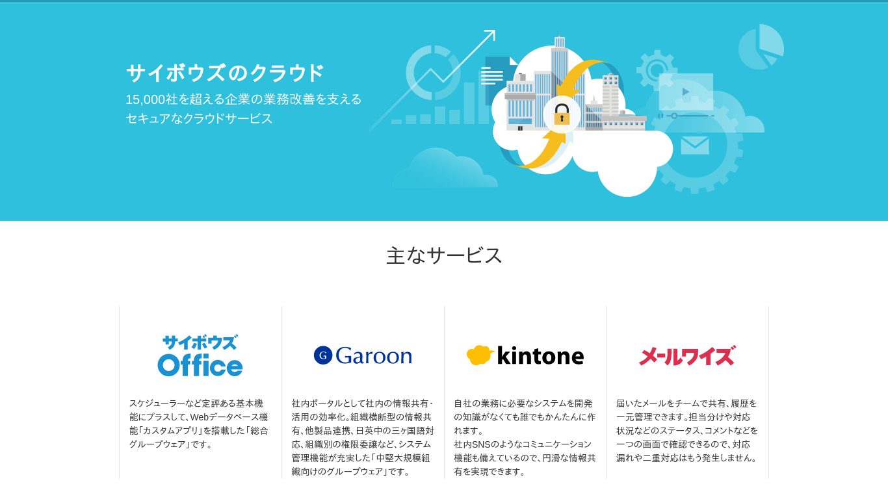

---
# サイボウズのサービスを支えるログ基盤 - ゼロからの刷新とこれから

- Cybozu Inc.
- @ueokande

---
# アジェンダ

- サイボウズはクラウド6年目
- サイボウズのログ基盤が、生まれ変わりました

---
# whois

- 上岡 真也
- 2016年サイボウズ入社
- アプリケーション基盤チーム
- GitHub/Twitter: @ueokande

---
# 目次

- 従来のログ基盤の限界
- ゼロからの刷新
- ログ基盤のこれから

---
# cybozu.comとは

- 2011年にスタートした、企業向けクラウドサービス
- 契約者数 17,000社以上
- ユーザ数65万人以上

---
# cybozu.comのインフラ事情

- 自社製データセンター
- ホスト数(実機 + VM): **1000+**
- ログ量 20億 行/day, 800 GB/day, 

---
# これまでのログ基盤

1. ローテートされたログをtar化
  - ログファイルは**1分間隔**でlogrotateする
2. SSHでtarを転送
3. 転送できたログを削除する

---
# 何が問題か？

## スケールできない

- ログの量は日々増えるが、転送システムは容易に増やせない
- 転送量がスループットに追いつきつつあった

## 冗長構成できない

- ログ転送システムがSPOF
- ログが転送されないと、ディスク使用量が肥大化する

## 転送されてから閲覧できるまでが遅い

- アプリケーションログが開発者が閲覧可能になるまで20分くらい

---
# ちくちょう、刷新だ

---
# 新ログ基盤の要件

## at least once

- ログを取りこぼすことなく集める

## スケーラビリティ

- ログの量が増えても安全な設計

## 信頼性

- 単一障害点を取り除いて、ログの転送が止まらないように

---
# 新ログ基盤アーキテクチャ

- 各ホストはKafka（分散メッセージングサービス）に対してログを吐き出す

---
# Apache Kafka

## 分散メッセージングサービス

- Broker間でレプリケーションするので、Brokerが死んでもOK
- クラスタにBrokerを追加することで容易にスケールできる

## pub/subモデル

- pub(ログを書く側) とsub(ログを読む側)が独自のタイミングで読み書きする
- pub/sub間のスループットやタイミングを考えなくてもよい

---
# At least once

## Host -> Kafka cluster

- fluentd/だと満たせないので、自前で転送エージェントを実装
- どこまでログを送ったかを記録

## Kafka ->

- データの処理が終わったoffsetをcommitする
- auto commitを無効化

---
# スケーラビリティ

- Kafka clusterは、Brokerノードを増やすことでスケールできる
- HBase、Hiveも、Hadoop上のサービスなので、スケールしやすい
- 新たにログが必要な要件が増えた時、Kafka Consumerも増やせる

---
# ログの解析など

kafka -> Airpalの話

---
# 苦労話 - at least once

- 1行が長いログも捨てたくない

---
# 苦労話 - journaldの信頼性やばい

- 当初は、すべてのログをjournaldに集めるという計画があった。
- Disk Full時に落ちる、長いログが勝手に折り返される
- ファイル最強

---
# 苦労話 - ログが詰まる

- kafkaのパラメータチューニングをミスると、すぐにKafkaのログが詰まる
- 根本原因はトピックの長さが違うから
- パラメータチューニング頑張るしかない

---
# 苦労話 - その他いろいろ

---
# これからのログ基盤

- ユーザデータとの連携
- 可視化・解析

---
# まとめ

- サイボウズのログ基盤が生まれ変わったよ
