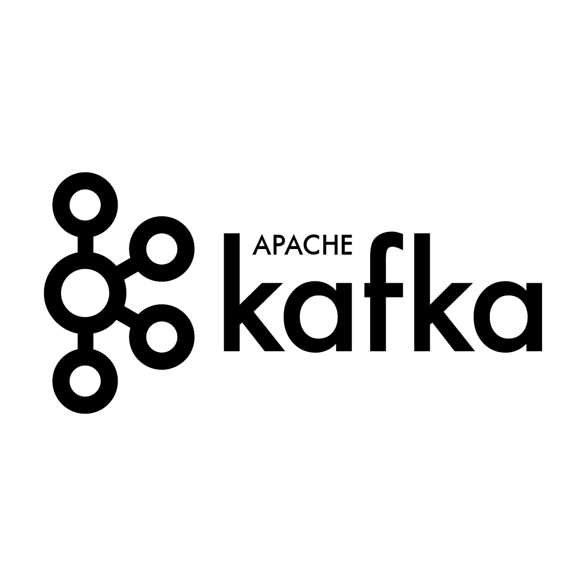

--- { "class": "title" }
# サイボウズのサービスを 支えるログ基盤

## ゼロからの刷新とこれから

Cybozu Inc.

@ueokande

---
# アジェンダ

- サイボウズはクラウド6年目
- サイボウズのログ基盤が、生まれ変わりました

---
# whois

- 上岡 真也
- 2016年サイボウズ入社
- アプリケーション基盤チーム
- GitHub/Twitter: @ueokande

---
# 目次

- これまでのログ基盤の限界
- cybozu.comとこれまでのログ基盤
- ログ基盤のゼロからの刷新
- 新しいログ基盤のこれから

--- { "class": "section" }
# cybozu.comとこれまでのログ基盤

--- { "class": "cybozucom" }
# cybozu.com

---
# cybozu.comとは

- 2011年にスタートした、企業向けクラウドサービス
- 契約者数 19,000社以上
- ユーザ数70万人以上

---
# cybozu.comのインフラ

- 自社製データセンター
- ホスト数(実機 + VM): 1000+
- ログ量
  20億 行/day,
  800 GB/day くらい  
  （毎秒平均 23,000行 くらい）

---
# これまでのログ基盤

1. ローテートされたログをtar化
2. SSHでtarを転送
3. 転送できたログを削除する

---
# 何が問題か？

## ログ量増加に追いつかない
- 転送量がログ量に追いつきつつあったが、スケールできない
- ログ転送システムがSPOF

## ログを有効活用できない
- 可視化・解析できる仕組みがない
- そもそも新しい仕組みも導入しにくい

--- { "class": "damm" }
# ちくちょう。 刷新だ！

sleeping worker by reynermedia - flickr | <u>https://www.flickr.com/photos/89228431@N06/11285432175</u>

--- { "class": "section" }
# ログ基盤のゼロからの刷新

---
# なぜログ基盤が必要か？

1. ログを保存する
2. アプリケーション・インフラの障害対応
3. 製品の改善につなげる

---
# 新ログ基盤の要件

## at least once

- ログを取りこぼすことなく集める

## 信頼性

- どこかで障害が発生しても、全体の転送が止まらない

## ログの長期保存

- 10年間はログを保存できる仕組み

---
# 新ログ基盤アーキテクチャ

- 各ホストはKafkaクラスタに対してログを吐き出す
- Kafkaからぞれぞれのサービスがログを利用

---
# Apache Kafkaとは

- pub/sub型の分散メッセージングシステム
- LinkedInが開発してOSS化した
- Twitter、Netflix、LINEなどの採用実績

---
# Apache Kafkaを使う理由

## 分散メッセージングサービス

- Brokerを追加することで容易にスケール
- Broker間でレプリケーション

## pub/sub型

- 入力と出力が独自のタイミングでを読み書きする
- pub/sub間のスループットやタイミングを考えなくてもよい

---
# 各ホストからKafka cluster

## 転送エージェント

- ログファイルの更新を監視してKafkaに送る
- 転送が完了したログはディスクから削除

---
# Kafka clusterから各サービス

## HBase

- ログをHadoop上に長期保存する

## Hive

- ユーザの動向をクエリで検索・解析する

## Graylog

- ログの検索、監視

---
# At least once

- システム全体で、ログを取りこぼすことなく配送
- どこかのノードが**突然の死**を遂げても、ログの不整合やデータロスが発生しない
- ストレージ・HDFS上のファイル操作はアトミックに

---
# At least once | 各ホストからKafka

- 当初はfluentdでKafkaへの転送で構築していた
- fluentdはat least onceを満たせないことが判明
- 自前で自作エージェントを実装
- 結局自分で

---
# At least once | Kafkaからの転送

## Kafka -> HBase

- データの処理が終わったoffsetをcommitする
- auto commitを無効化

## Kafka -> Hive

---
# At least once | 長いログの対応

- Kafkaのレコード長には上限があるが、ログの長さは予想できない
- MySQLのスローログでは、1行が10MBを超えるケースもある
- Kafkaのレコードに、断片化されたログかのフラグを付与

---
# 信頼性とログの長期保存

## 信頼性

- Kafkaのノードが死んでも、全体の転送は止まらない
- ログ量が増えたら、Kafkaノードを増やしてスケール

## ログの長期保存

- ログはHadoop上に長期保存
- 容量が増えたらHadoopクラスタをスケールするだけでOK

---
# 苦労話 | 転送遅延

- ある日、Kafkaからの転送が大きく遅延した
- 幸い本番環境と同じ環境を開発環境に構成してたために気付けた
- Kafkaのパラメータチューニングして解決

---
# 苦労話 | journaldに悩まされる

- ホストのすべてのログをjournaldに集める計画もあった
- 社内でjournaldを運用していたらいろいろ問題が
    - 長いログの行が勝手に分割される
    - Disk Full時にjournaldが死亡する
- 結局ファイル最強だった

--- { "class": "section" }
# 新しいログ基盤のこれから

---
# これからのログ基盤

- ユーザデータとの連携
- 可視化・解析

---
# まとめ

- サイボウズのログ基盤が生まれ変わったよ
